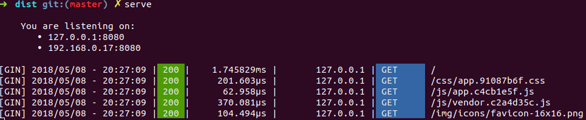

# serve

A minimalistic http server that helps you to test your frontend without any hassle.



## Installation
```sh
go install github.com/lherman-cs/serve
```

## Usage
```
Usage:
  serve [flags]

Flags:
  -h, --help          help for serve
  -p, --port uint16   Port to listening on (default 8080)
```

